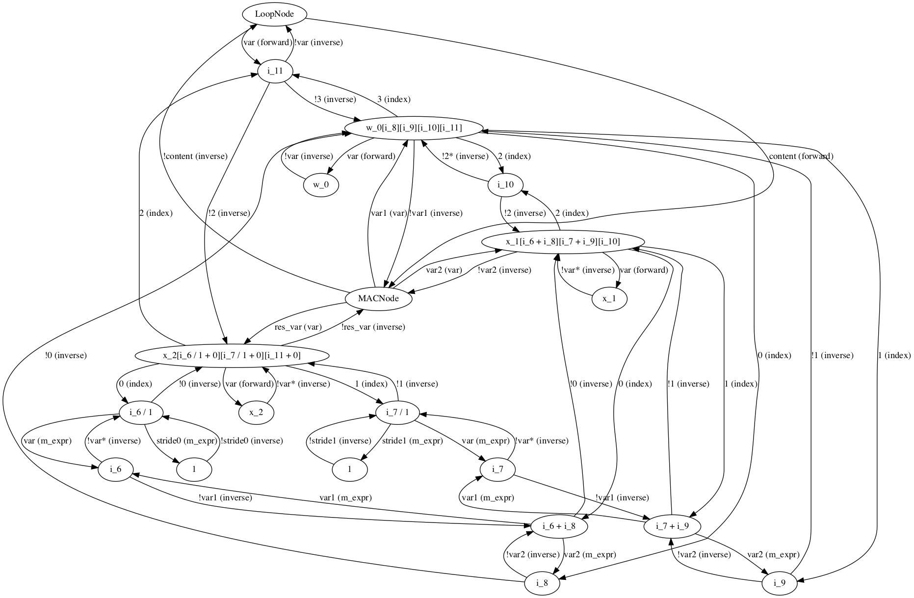
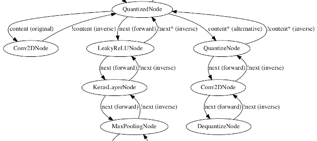

# NNCG: Neural Network Code Generator

## Table of Contents

- [Project Goals](#project-goals)
- [Current  Status](#current-status)
- [Getting Started](#getting-started)
- [Developer Documentation](#developer-documentation)
- [C Code Example](#C-Code-Example)
- [License](#license)
- [Contact](#contact)


## Project Goals

For the deployment of machine learning models on resource constrained
systems like mobile or IoT devices, usually a framework like TensorFlow
(Lite) is utilized. With this research project we try to avoid any
dependency and thus generate pure ANSI C code that can be 
directly embedded in to existing software projects for embedded devices. This simplifies the
compilation, linking and deployment process. In addition, this allows
to generate fast code as we can exploit the knowledge about the model
structure (size of matrices etc.) and about the target hardware (SIMD
instructions etc.). Further details can be found in our paper:

* *"A C Code Generator for Fast Inference and Simple Deployment of
Convolutional Neural Networks on Resource Constrained Systems"* available
on [arXiv](https://arxiv.org/abs/2001.05572).
* Accepted for 2020 IEEE International IOT, Electronics and Mechatronics Conference (IEMTRONICS).

## Current Status

This is a research project and not ready for everyday use.
We welcome any kind of feedback via the issue tracker or by email.
In the following we give an answer to two main questions, important for an application:
Is my network supported? And is my target device supported?

### Is my network supported?

In short, a subset of Keras layers is supported.
Deep neural networks can be complex and research is continuing to develop new
structures and layers on a month by month basis. Thus, it won't be possible to support every
kind of network or layer. However, it is already possible to generate code for
a VGG16 convolutional neural network and all kind of networks based on the layers of this network.
Currently the following layers are supported:

* Convolution2D with padding valid/same and strides
* MaxPooling2D with strides
* Dense
* Softmax
* ReLU with "leaky" feature

### Is my target device supported?

In short yes, but... Whatever device you want to generate code for, as long
as you have an ANSI C compiler you can compile the generated code for your device.
E.g. this can be your x86-64 PC, an STM32 microcontroller or an Amiga 500. However,
if you care about speed, it becomes more difficult to give an appropriate answer. Usually, a C compiler _shoud_
utilize all features available on your platform to generate a performance optimized executable. In fact, all
compiler we have tested are not able to fully unleash the potential of the platforms, e.g. efficiently use SIMD instructions.

Thus, if your device supports some special instructions set to speed up computations that are not used in an efficient way automatically
by your compiler, this code generator builds an excellent basis for performance improvements. As said SIMD
instructions like Intel's SSE, AVX, etc. or ARM NEON are good examples.

To make it short, besides the general architecture the compiler currently
supports SSE3.

## Getting Started

Here we check out the code, train a simple CNN for pedestrian detection,
generate C code for inference, compile it and test it.

These steps require a UNIX like system (macOS, Linux etc.) or the
Windows Subsystem Linux (WSL). Actually, it should work also on Windows
with slightly different steps.

### Prerequisites

* Install clang. This is required to test the generated code.

* Install Python 3. At least 3.7 is required.


You may want to create and activate a new virtual environment by choosing the python3 interpreter and making a `~/venv` directory to hold it:

```shell
python3 -m venv --system-site-packages ~/venv
source ~/venv/bin/activate  # sh, bash or zsh
```
Your shell prompt is possibly prefixed with `(venv)`, when the virtual environment is active.

Install the required packages for usage with python3. If executed within the virtual environment, this does not affect the host system setup.

```shell
pip3 install -U pip
pip3 install -r requirements.txt
```

### Clone

Clone the repository:

```shell
git clone https://github.com/iml130/nncg
cd nncg
```

### Create the Image Database

Download the image database:

```shell
mkdir db
wget http://www.lookingatpeople.com/data/Daimler/pami06-munder-gavrila/DC-ped-dataset_base.tar.gz -P db
tar xvzf db/DC-ped-dataset_base.tar.gz -C db
```

We now generate an image database, saved to a single file:

```shell
export PYTHONPATH="${PYTHONPATH}:."
python3 applications/daimler/gen_imdb_daimler.py -i db
```

This created two new files: `img.db` and `img.db.x`. The first one is a pickle dump (as
it is a NumPy array) and the second one is saves in NumPy format.

### Train the Neural Network

Now let's train the net:

```shell
python3 applications/daimler/train.py
``` 

This created the file `model.h5`.

### Generate and Compile Code

We now generate code for the net:

```shell
python3 applications/daimler/compile.py
```

In `compile.py` contains two calls to generate code. One to generate for a general architecture resulting in ANSI C code
and one including intrinsics for SSE3. You can also see that during generation, both files are compiled and executed on
1000 images (each) to test if the generated code really does what we expect. However, we next illustrate how to compile it manually:

```shell
clang -DCNN_TEST cnn_gen.cpp -o cnn_gen -lm
```

NNCG also generates a main function that must be enabled by defining CNN_TEST. However, it
does not provide a reader for common image files and can only read the `img.bin` written by the internal
test. But we can use it as an example:

```shell
./cnn_gen img.bin
```

The results are written to `results.txt`.

## Developer Documentation

As said above, it is likely that you want to use layers that are not implemented or target devices with SIMD
instructions or other accelerations that are not supported yet. The paradigm of this framework is to put
as much as possible logic and functionality into the framework to keep layer and optimizations simple. E.g.
the most complex layer so far is the Conv2D layer and it is implemented with 135 lines. The optimization
for SSE3 requires 26 lines.
 
This section explains some of the concepts so you can more easily understand the commented code. If you want
to implement new layers and optimizations you then might want to see the existing code as example.

### Graph Structure

Comparable to usual compilers and machine learning frameworks, the neural network is structured as a graph.
The base classes are implemented in `traverse/tree.py`. Basically, it's a directed graph with edges like a
double linked list. There are classes for nodes and edges. The latter store information about the edge
where two attributes are important: The name of the edge and the type. The name must be unique among all
outgoing edges of a node as the name is used as key in a dictionary. The type is not unique. An important
type is _inverse_ as these are the opposite edges in the double linked list. They are automatically
created and administrated. Inverse edges are named like the original edge but with a preceding _!_. It may
happen that an edge with an existing name has to be created, then a _*_ is prepended until it is unique.
In the example plot below you can find examples for this.

### Graph Actions

What makes the graph powerful here are the TraverseActions. To perform an existing action
you have to create an instance of the desired action and call `node.traverse(action)` to run it on the graph:

```Python
        action = SearchNodeByType(MACNode)
        self.root_node.traverse(action)
```

This, for example, searches for all nodes of type MACNode and stores the result in action.result.

If you want to write a new action, derive a new class from TraverseAction and overwrite these functions:

* `__init__()` for initialization
* `_pre_action()` which is called on a visited node before all subnodes are visited
* `_post_action()` which is called on a visited node after all subnodes are visited

Like in SearchNodeByType you can stored data and results in your newly created class.

Currently the following actions are available:

* AddToPydot: Creates a Pydot graph that can be plotted (see below).
* DeepCopy: Makes a DeepCopy of a (partial) graph respecting the graph structure.
* DeepCopyLoop: Same as above but just to copy a LoopNode.
* ReplaceExpression: To replace an Expression in the graph.
* SearchNode: Search for a specific node (identified by the python id).
* SearchNodeByType: Like above but search for a type (identified by the python class type).
* SearchNodeByName: Like above but search for a specific name.
* WriteCAction: Internally used to write the C code file.

Let's, for example, now use some actions to plot a part of the graph. Set a breakpoint in `nncg.py` after
the call `self.abstract_to_c()`. After reaching the breakpoint enter the following at your prompt:

```Python
        action = SearchNodeByType(MACNode)
        self.root_node.traverse(action)
        action.result[0][-2].plot_graph('plot.png')
```

The usage of the AddToPydot action is hidden in `plot_graph()`. However, you can see that it is possible to
start at any point in the graph with a TraverseAction. Furthermore, you can see that we use the first result
of the search (by accessing element 0 in result) and then start the plot at the second last node. The result is:



That looks somewhat complex as all nodes including IndexVariables and Expressions are plotted, see below for details.
However, you will see the LoopNode with an edge _content (forward)_ to the MACNode. We will explain details
about these nodes below.

### Node Types

NNCG uses a graph structure to store all kind of information, obviously for representing the CNN,
but also to store meta information that are not required for an inference but useful for different kind
of operations on the graph, see below. In the following sections the available node types are explained.

**CNN Nodes**

These are the nodes of the highest level as they combine most information about an operation in a single node.
They are generated close to the structure of the CNN in the Keras model. Lowering must be called
to generate additional nodes that can write C code.

**AlternativesNode**



Some nodes are derived from AlternativesNode, e.g. UnrolledOperation or QuantizedNode.
In case of UnrolledOperation this means that we now have two paths, one
containing the unrolled loop and one with the original not unrolled operation. If we later are
able to utilize the unrolled loop for e.g. SSE code, we switch to this path. If the unrolled loop
cannot be utilized and is thus not useful, we just do not switch to it and stay with the original 
operation. Another example for an AlternativesNode is the QuantizedNode. The image above shows both paths:
"content (original)" is the currently active path without quantization and "content* (alternative)" is an alternative
that is the quantized convolution. 
If the quantization is
useful e.g. for a SSE instruction for integer multiplication we switch to the quantized path. Otherwise
we use the original path as quantization reduces the accuracy.

**Arithmetic Nodes**

Nodes that represent an arithmetic function like MAC. Base nodes exist
as one-, two- and three-address nodes. In the example plot
you can find three outgoing edges of type _var_ at the MACNode:
 _var1 (var)_, _var2 (var)_ and _res_var (var)_. Thus,
it is a three-address node of the form _res_var += var1 * var2_.

**Control Flow**

Currently the LoopNode and UnrolledOperation. The latter is added by `unroll()`
method of a LoopNode for representing meta information about the performed unroll.

**Language**

Nodes specifically for C code. Writes function header, main function, initial data etc. Both are
(more or less) singleton classes as we only write one C code file.

**Expressions**

Besides the nodes described above some nodes cannot be part of the graph as stand-alone nodes and cannot
write C code. These are:

* Expressions
* Constant
* Variable
* IndexedVariable

Expressions are more or less what an expression is in C, e.g. a multiplication. It is not required
to use them for calculations but can help in case a flexible structure is required, e.g. they are used in
IndexedVariables.

Variables are comparable to C in case of a scalar, e.g. int, float etc. Variables can also be arrays
but without indices. Note in the plot above that each Variable is unique in the graph with multiple edges pointing
to it. As every reference in C to a name of a variable is a reference to the same variable this is also the case here.
As an example, variable _i_11_ is the counter variable for the LoopNode. From the MACNode follow the _res_var_
pointing to an IndexVariable. From here follow the edge with name _2_ meaning _i_11_ is also used in the second index.

Constants are obviously the same as variables but are constant.

To add indices to an array IndexedVariables are used. They are instantiated with an existing variable and always
have all indices set, e.g. `x_10[i_49 / 4 + 0][i_50 / 2 + 0][i_51 + 0]`. As we can see, the indices are
instances of the class Expression containing Variable and Constant instances, e.g. the counter variables
of loops. You can also find IndexVariables in the plot above with edges called _0_, _1_, _2_, etc. of type
_index_. These are edges to the Expressions representing the indices pointing to further Expressions, Variables etc.

### Graph Lowering

The C code file is currently generated by the following steps:

* Reading Keras model and creating nodes in CNN.py.
* Quatization: For all possible nodes (currently Conv2D) a QuantizedNode is inserted with the quantized
  Conv2D and as an alternative the original (not quantized) Conv2D. 
* The function `lowering()` is called on all nodes to create fine grained subgraphs
defining a structure that can directly be written to C code, e.g. loops.
* Running optimizations to convert subgraphs for general architecture to subgraphs using e.g. SSE3.
* Call all `write_c()` functions to write C code. 

The following subsections explain this in detail.

**Creating CNN Nodes**

In the first step the Keras model is parsed layer by layer and weights are extracted.
The classes in `CNN.py` are instantiated to represent the same CNN as in Keras.
There is no 1:1 relation between Keras layers and NNCG nodes. Some Keras layers can
just be ignored like Dropout as they are only required for training and for some
Keras layers more than one NNCG node is generated. However, the level of abstraction
should be the same, i.e. all information given by Keras are represented in the NNCG
graph so no meta knowledge is lost.

Here, **meta knowledge** is what is not directly
required to infer the CNN but probably useful for the code generation steps.
E.g. a Conv2D layer can be executed by using 6 loops and an equation in the form of
`y += a * x` (plus bias). However, if we just represent a Conv2D by loop nodes and this
multiplication we have lost the information that it is a convolution operation.
If we now want to optimize our code for an architecture that provides a matrix
multiplication operation we would have to gather information from these simple
loops that in fact we have some form of matrix multiplication here. Thus, in the first
step, all nodes generated represent the highest level of knowledge about the operations
we have to do.

**Quantization** 

Quantization means that we do all calculations with integers instead of floats. In this phase, a quick check is done
if this could be useful here. If yes, a QuantizedNode is added with some more nodes for pre- and post-processing.
Furthermore, the original node like Conv2DNode convert its weights to integers. First, the range of the floats
is checked for some example images using the provided image database. This results in a factor to scale the floats
to the range of an 8 bit or 16 bit integer. The result can be seen in the AlternativesNode section. QuantizeNode and
DequantizeNode are required to convert the feature layers to integer and back to float during runtime.

**Lowering to Fine Grained Graph**

In this step all nodes of the graph are checked for a `lowering()` function which is then
called. This creates a new subgraph for every node and it is added as content (an edge with name "content")
to that CNN node. This completes
the overall graph such that it can be written as C code. The structure of the graph is not
optimized yet. It just contains everything to write an ANSI C file for a general architecture.

As mentioned, nodes representing C code are added as content so that the original node, e.g. Conv2D, is still
in the graph.
The principle of lowering is to never lose meta information and, if possible, add meta information when
performing operations that could add complexity to the graph. This way, it is still known that this C code nodes
represent a Conv2D.

Another example is the loop unrolling optimization (function `unroll()` in `LoopNode`).
It first adds a UnrolledOperation node containing information about the unroll performed. Then the
unrolled content is added to this node. Future operations on the graph now know that here
we have multiple operations of the same form as they are created due to an unroll. 
Furthermore, UnrolledOperation
is an AlternativesNode, see above for what an AlternativesNode is.


**Optimizations**

Currently as an example platform SSE3 is supported. Optimizations like this one
specialize the graph for a specific platform that previously supported all platforms.
However, in each step it should be made sure that the graph is always a valid one,
i.e. after each step it should be possible to write a C code file as later
steps rely on it. Writing optimizations should be simple due to available helper functions
and actions like ReplaceExpression, SearchNode, DeepCopy, unroll and join in LoopNode
etc. See `to_sse3()` in `nncg.py` for an example.

Note that in case of AlternativesNodes all alternatives will be checked if SSE3 can be 
utilized and the path with the fastest implementation will be activated.

### Tests

As nobody can guarantee that layers and optimizations a free of bugs, the generate code file will be compiled
and tested. Tests are performed by using random weights and random image data. 
After each Keras layer the intermediate results are extracted while the compiled file
also saves the intermediate results after the same layers. If the difference between these results are
larger than a threshold the test fails.

This testing can always be done after code generation. Besides the pedestrian classification example,
this repository also contains the file `tests.py` testing some CNNs that use different features in various
combinations, e.g. a small CNN without dense layer but also a full VGG19. Here not real images are used but
random data so that the results are not useful but can be compared with the output of Keras. Thus, `tests.py` be can
be started without parameters or datasets.

**Testing Quantized Layers**

Results of quantized CNN are also compared to the orignal CNN in Keras. Thus, it will show differences and errors even if the code
was generated without bugs. However, the errors should be small and in most cases a classification leads to the same
class. Unfortunately, we cannot use random data anymore as classes may be different in edge cases. We therefore
have to use a trained network with images from the training dataset that are classified with a high score. The score
may then be slightly different but the infered class should be the same.

The script `tests.py`now accepts the option `-i <path>` where `<path>` is the path to a folder containing
some example images. Let's say, we use `-i imagenet_examples`. Then the folder should look like:

```
imagenet_examples
├── 0
│   ├── n01440764_18.JPEG
│   └── n01440764_36.JPEG
├── 1
│   ├── n01558993_1233.JPEG
│   └── n01558993_190.JPEG
├── 2
│   ├── n01774384_101.JPEG
│   └── n01774384_908.JPEG
└── 3
    ├── n01986214_10469.JPEG
    └── n01986214_2927.JPEG
```

The images files are extracted from the Large Scale Visual Recognition Challenge 2012 (ILSVRC2012).
Unfortunately, I may not provide some example images here. You can 
[download the dataset here](http://image-net.org/challenges/LSVRC/2012/) and choose some images from
some different classes to setup a folder like above on your own.

If you run `tests.py` like this it will test quantization using VGG16 and VGG19. The weights will
be downloaded automatically.

 


## C Code Example

This example represents a code snipped of a machine learning model.
Since we know the structure of the model, we generate code for a specific target platform.
For example, SSE3 instructions are used to parallelize the calculation over the number of filters
for a convolution layer.

A full example can be found in `examples/daimler.c`.

```C
void cnnsse3(float x_0[36][18][1], float *scores)
{
    static float x_1  [38][20][1] = { 0 };
    static float x_2 alignas(16) [36][18][4] = { 0 };

...

    for (int i_40 = 0; i_40 < 9; i_40 += 1) {
            for (int i_41 = 0; i_41 < 4; i_41 += 1) {
                for (int i_42 = 0; i_42 < 3; i_42 += 1) {
                    for (int i_43 = 0; i_43 < 3; i_43 += 1) {
                        for (int i_44 = 0; i_44 < 8; i_44 += 1) {
                            for (int i_45 = 0; i_45 < 16; i_45 += 4) {
                                {
                                    __m128 w, x, y;
                                    w = _mm_load_ps((float*)&w_2[i_42][i_43][i_44][i_45]);
                                    x = _mm_load_ps1(&x_7[i_40 + i_42][i_41 + i_43][i_44]);
                                    y = _mm_mul_ps(w, x);
                                    x = _mm_load_ps((float*)&x_8[i_40 / 1 + 0][i_41 / 1 + 0][i_45 + 0]);
                                    x = _mm_add_ps(x, y);
                                    _mm_store_ps((float*)&x_8[i_40 / 1 + 0][i_41 / 1 + 0][i_45 + 0], x);
                                }
                            }
                        }
                    }
                }
            }
        }
...

    flat_x_0 = x_12;
    for (int i_57 = 0; i_57 < 2; i_57 += 1) {
        sum_0 += expf(flat_x_0[i_57 + 0]);
    }
    for (int i_58 = 0; i_58 < 2; i_58 += 1) {
        x_13[i_58 + 0] = expf(x_12[i_58 + 0]) / sum_0;
    }
    return;
}
```


## License

NNCG is licensed under the terms of the Apache license. See [LICENSE](LICENSE) for more information.


## Contact

NNCG was initially developed by Oliver Urbann and its development is currently continued by the Fraunhofer Institute for Material Flow and Logistics.
